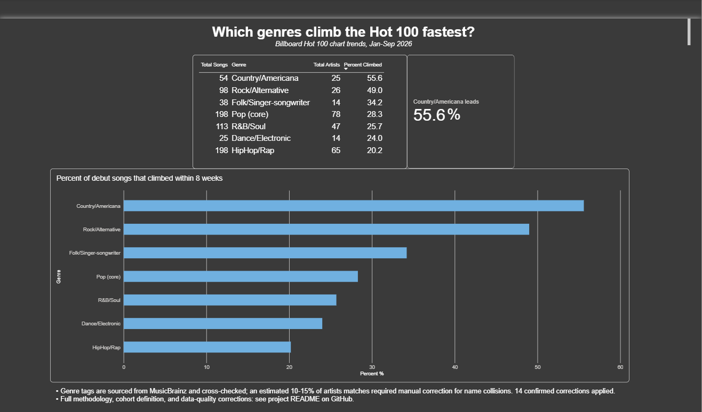
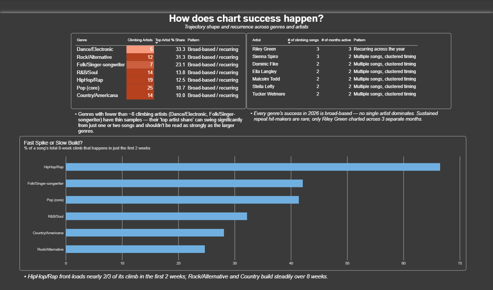

# Music Trend Agent

An agent-driven ETL pipeline (built with the Claude Agent SDK) that extracts, cleans, and analyzes Billboard Hot 100 chart data to answer a real question: which music genres climb the charts fastest?

This project was built to demonstrate a reusable agentic data pipeline for a data analytics job search - the specific finding is a proof point, but the architecture is designed to generalize to other datasets.

## The finding

Country/Americana and Folk/Singer-songwriter climb the Hot 100 fastest in 2026; Hip-Hop/Rap climbs slowest - roughly a 2x gap, confirmed three independent ways across 37 weeks of chart history. Alternative Rock is the single most robust individual result.

Two supporting findings:
- No genre's success is driven by one breakout artist - every genre's climbing songs are spread across many different artists.
- Hip-Hop front-loads its climb (66.5% happens in the first 2 weeks); Rock/Alternative and Country build steadily (only ~25-28% happens that early).

## Dashboard

Built in Power BI, connected live to the BigQuery warehouse below. Not published/hosted - screenshots below.

### Genre climb speed


### Deeper patterns - speed, breadth, repeatability


## Architecture

Four pipeline stages, each a Python tool callable by a Claude Agent SDK agent:

1. Extraction - Billboard Hot 100 (billboard.py) + MusicBrainz artist genre metadata (musicbrainzngs)
2. Cleaning/staging - joins both sources, fixes data-quality issues (see below), filters genres through a curated allowlist
3. Loading - writes to Google BigQuery, gated behind a real terminal confirmation prompt (not just a written convention)
4. Reporting - an agent that writes and executes its own SQL, then checks its own findings for statistical validity (sample size, outlier sensitivity, cross-method agreement) before reporting them

A deliberate design choice: only the reporting stage calls the Claude API at runtime. Extraction, cleaning, and loading are deterministic - the correct behavior is already known, so they run as plain, fast, zero-API-cost Python functions. The agent is used only where judgment is genuinely required.

## Tech stack

Python, Claude Agent SDK, Google BigQuery, dbt, Power BI, billboard.py, musicbrainzngs

## Data

- 37 weeks of Billboard Hot 100 history (Jan 3 - Sep 12, 2026)
- 654 total songs, 230 unique primary artists
- 3,700 rows loaded into BigQuery

## Methodology

The genre-climb analysis uses a specific, deliberately narrow cohort - not the full chart:

- Debut songs only (weeks_on_chart = 1)
- Excludes release-week "album dumps" (5+ simultaneous debuts from one artist)
- Requires a full 8-week observation window (so early and late debuts are compared fairly)
- Requires at least one recognized genre tag
- Genre groupings require a minimum of 5-8 songs to be reported at all

169 of 654 songs (26%) meet all criteria. The finding describes newly-debuting, non-flooded singles - not the chart as a whole.

Climb metric: debut_rank minus best rank achieved within 8 weeks. A song debuting at #80 and later reaching #20 has a climb of 60.

## Known limitations

MusicBrainz's genre data is community-tagged and occasionally matches an artist's name to a different, unrelated real-world person who shares that name. This is a real, non-trivial error source - not a rare edge case.

14 confirmed mismatches were identified and manually corrected. A representative sample:

| Artist (as charted) | Wrong match assigned | Actual genre |
|---|---|---|
| J. Cole | Fantasy-novel audiobook author | Hip-Hop |
| Ella Langley | Jazz/big band musician | Country |
| Junior H | Unrelated blues musician | Corridos / regional Mexican |
| Jelly Roll | Jelly Roll Morton (1940s jazz) | Country-rap |
| Rod Wave | Unrelated adult-contemporary artist | Melodic rap / R&B |

Full list of corrections: Junior H, Julia Wolf, George Birge, J. Cole, Olivia Dean, John, John Morgan, Josiah Queen, Leon Thomas, Ella Langley, Steve Lacy, Jordan Davis, Dylan Scott, Rod Wave.

An estimated 10-15% of the ~230 unique artists may contain similar uncaught errors. Every discovery of a new correction came from actually querying the data for a new purpose - not from a single exhaustive sweep - so this is a reasonable estimate, not a guaranteed ceiling.

## Debugging journey

This pipeline hit a long chain of real, evidence-diagnosed bugs - the debugging process is genuinely a bigger part of the story than the final result:

- Tool-permission gap - allowed_tools only pre-approves tools, it doesn't restrict availability; the agent could still reach for Bash/Write until disallowed_tools was added explicitly
- A fake 100% match rate - an unvalidated confidence-score check silently let low-quality artist matches through
- Transient network failures masquerading as bad data - required adding retry logic to distinguish "genuinely unmatched" from "the request briefly failed"
- A deprecated library attribute - billboard.py's previousDate field is permanently None per the library's own source comments; backfilling required computing historical dates manually instead
- Bot-detection blocking - Billboard's servers intermittently served empty responses to unmarked automated requests; fixed by setting a real browser User-Agent
- Collaboration-credit mismatches - searching MusicBrainz for a full credit string like "X Featuring Y" matched the wrong entity entirely; fixed by extracting the primary artist before lookup
- Recurring name-collision errors (see Known Limitations) - the single largest and most persistent data-quality issue, caught incrementally through actual use of the data rather than a single validation pass

## Running the pipeline

```bash
python -m venv venv
.\venv\Scripts\Activate.ps1
pip install claude-agent-sdk python-dotenv billboard.py musicbrainzngs google-cloud-bigquery
```

Set ANTHROPIC_API_KEY and BIGQUERY_PROJECT_ID in .env, and set GOOGLE_APPLICATION_CREDENTIALS to your BigQuery service account key. Then run:

```bash
python main.py
```

See CLAUDE.md for full project context and conventions.
